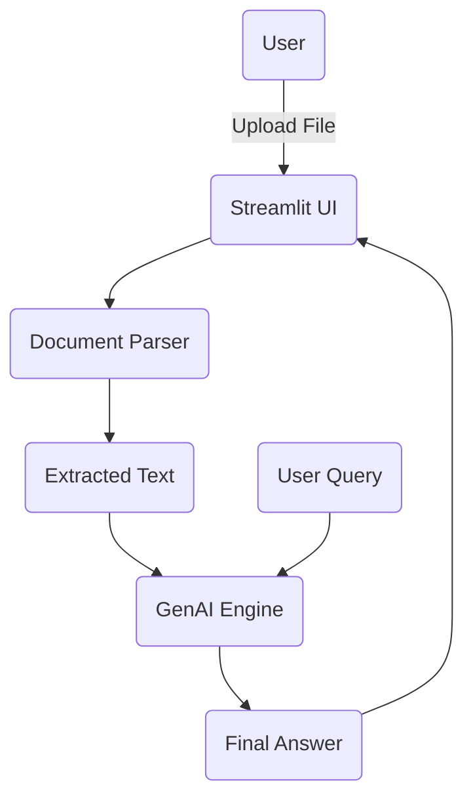

# **INFLO**

### Intelligent File Loader & Orchestrator

AI-powered document parser and Q&A engine that transforms PDFs, DOCX files, and text into clean, contextual insights.

---

## Badges


---

# Table of Contents

* [Overview](#overview)
* [Key Features](#key-features)
* [Live Flow](#live-flow)
* [Architecture](#architecture)
* [Tech Stack](#tech-stack)
* [Installation](#installation)
* [Configuration](#configuration)
* [Usage](#usage)
* [Project Structure](#project-structure)
* [API Key Security](#api-key-security)
* [Troubleshooting](#troubleshooting)
* [Roadmap](#roadmap)
* [Contributing](#contributing)
* [License](#license)
* [Credits](#credits)

---

# Overview

INFLO is a streamlined AI utility that reads documents, extracts meaningful content, and answers questions using Google GenAI. It is designed for fast document understanding, analysis, and intelligent search.

---

# Key Features

* Multi-format document ingestion (PDF, DOCX, TXT)
* Robust parsing and text normalization
* AI-powered contextual answer generation
* Minimal and clean Streamlit interface
* Detailed error handling
* Secure environment-based API key usage
* Lightweight and extremely portable

---

# Live Flow

```
Upload File → Content Extraction → User Query → AI Engine → Final Answer
```

---

# Architecture



---

# Tech Stack

| Layer           | Technology   |
| --------------- | ------------ |
| UI              | Streamlit    |
| Backend         | Python 3.10+ |
| AI Engine       | Google GenAI |
| PDF Parsing     | pypdf        |
| DOCX Parsing    | python-docx  |
| Environment     | Virtualenv   |
| Version Control | Git / GitHub |

---

# Installation

### Clone the Repository

```bash
git clone https://github.com/your-username/INFLO.git
cd INFLO
```

### Create a Virtual Environment

```bash
python -m venv venv
source venv/bin/activate        # macOS/Linux
venv\Scripts\activate           # Windows
```

### Install Dependencies

```bash
pip install -r requirements.txt
```

---

# Configuration

### Create a `.env` file

```env
GENAI_API_KEY=your_api_key_here
```

### Verify Core Packages

```bash
pip show google-genai pypdf python-docx
```

---

# Usage

Start INFLO:

```bash
streamlit run app.py
```

Features available:

* Upload any supported document
* Extract and preview text
* Ask context-based questions
* Receive structured, clean answers

---

# Project Structure

```
INFLO/
│── app.py                 # Main Streamlit app
│── document_reader.py     # File parsing and extraction
│── requirements.txt       # Dependencies list
│── .gitignore             # Ignores sensitive files
│── README.md              # Documentation
```

---

# API Key Security

Your `.gitignore` includes entries such as:

```
.env
*.env
```

Avoid committing your API key.
Use environment variables or deployment-level secrets.

---

# Troubleshooting

### PDF unreadable

```bash
pip install pypdf
```

### DOCX parsing error

```bash
pip install python-docx
```

### anyio version conflict

```bash
pip install "anyio<5"
```

### GenAI missing key

Ensure `.env` contains:

```
GENAI_API_KEY=your_key
```

---

# Roadmap

* RAG pipeline with embeddings
* Multi-document conversational mode
* Exportable answers (PDF/Markdown)
* Batch file processing
* FastAPI backend rewrite
* Integrated file preview panel
* Response history and memory

---

# Contributing

1. Fork this repository
2. Create a new branch

```bash
git checkout -b feature-name
```

3. Commit your changes
4. Push your branch
5. Open a pull request

---

# License

### AGPL-3.0 License

This project is licensed under the **GNU Affero General Public License v3.0**.
Any modified or hosted version of this software must also remain publicly open-source under the same license.

Full license text is available in the `LICENSE` file.

---

# Credits

* Developed by **Rajwardhan Patil**
* AI Engine: Google GenAI
* Document Processing: pypdf, python-docx

---


